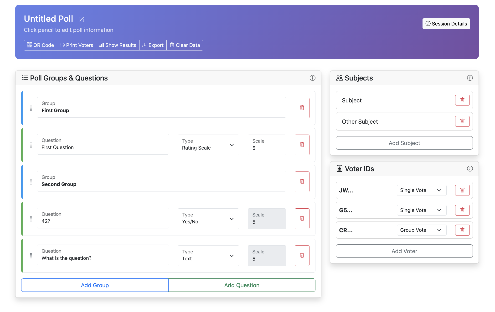
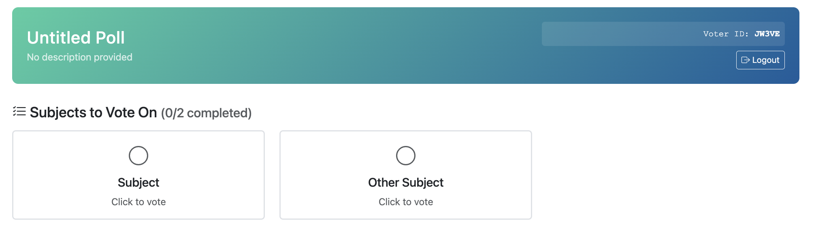
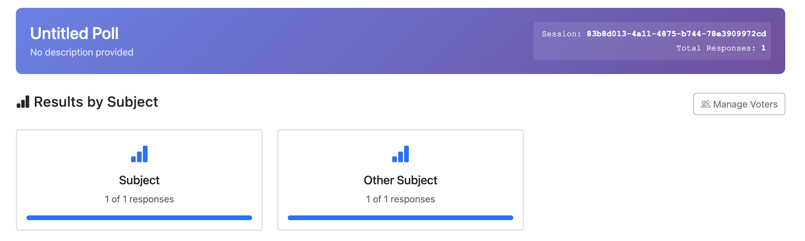

# Easy Voting Service

A secure, zero-knowledge voting system with client-side encryption and anonymous ballot submission. Perfect for polls, surveys, evaluations, and democratic decision-making processes.







## Features

### 🔒 Privacy & Security
- **Zero-knowledge architecture** - Server never sees unencrypted votes
- **Client-side encryption** using Web Crypto API
- **Anonymous voting** with unique voter keys
- **Session isolation** with SHA-256 hashed storage

### 📊 Flexible Voting Options
- **Multiple question types**: Rating scales, Yes/No, Text responses
- **Organized groups** for complex questionnaires
- **Multiple subjects** evaluation (candidates, proposals, etc.)
- **Single or group voting** modes per voter key

### 🎯 Easy Management
- **Intuitive configuration** interface with drag-and-drop
- **QR code generation** for easy voter access
- **Real-time results** with visual charts
- **Export/Import** complete sessions with voting data
- **Print-friendly** voter key distribution

### 🌐 Zero Setup Deployment
- No database required - file-based storage
- Self-contained web application
- Mobile-responsive design
- Works offline after initial load

## Quick Start

### Prerequisites

**Option 1: Node.js Installation**
- Node.js 16+ 
- npm or yarn

**Option 2: Docker Installation**
- Docker 20.10+
- Docker Compose 2.0+ (for docker-compose deployment)

### Installation

1. **Clone the repository**
   ```bash
   git clone https://github.com/Marloto/easy-voting-service.git
   cd easy-voting-service
   ```

2. **Install dependencies**
   ```bash
   npm install
   ```

3. **Start the server**
   ```bash
   npm start
   ```

4. **Access the application**
   - Configuration: http://localhost:3000/config.html
   - Voting: http://localhost:3000/vote.html
   - Results: http://localhost:3000/results.html

### Development Mode
```bash
npm run dev
```

## Docker Deployment

### Using Pre-built Image (Quickest)

Create a `docker-compose.yml` file:

```yaml
version: '3.8'

services:
  easy-voting-service:
    image: ghcr.io/Marloto/easy-voting-service:latest
    container_name: easy-voting-service
    ports:
      - "3000:3000"
    volumes:
      - voting_data:/app/data
    environment:
      - NODE_ENV=production
      - PORT=3000
    restart: unless-stopped

volumes:
  voting_data:
    driver: local
```

Then run:
```bash
docker-compose up -d
```

### Building from Source

1. **Clone the repository**
   ```bash
   git clone https://github.com/Marloto/easy-voting-service.git
   cd easy-voting-service
   ```

2. **Start with Docker Compose**
   ```bash
   docker-compose up -d
   ```

3. **Access the application**
   - http://localhost:3000

### Using Docker Only

**With pre-built image:**
```bash
docker run -d \
  --name easy-voting-service \
  -p 3000:3000 \
  -v voting_data:/app/data \
  ghcr.io/Marloto/easy-voting-service:latest
```

**Building from source:**
```bash
# Build the image
docker build -t easy-voting-service .

# Run the container
docker run -d \
  --name easy-voting-service \
  -p 3000:3000 \
  -v voting_data:/app/data \
  easy-voting-service
```

### Docker Management

```bash
# View logs
docker-compose logs -f

# Stop services
docker-compose down

# Restart services
docker-compose restart

# Backup voting data
docker run --rm -v voting_data:/data -v $(pwd):/backup alpine tar czf /backup/voting-backup.tar.gz -C /data .

# Restore voting data
docker run --rm -v voting_data:/data -v $(pwd):/backup alpine tar xzf /backup/voting-backup.tar.gz -C /data
```

## How It Works

### 1. Configuration Phase
- Create or upload a voting configuration
- Set up question groups with different question types
- Add subjects/candidates to evaluate
- Generate unique voter keys (5-character codes)
- Share voting link via QR code or URL

### 2. Voting Phase
- Voters access the system using their unique key
- All data is encrypted client-side before transmission
- Server stores encrypted votes without access to content
- Each voter can vote on multiple subjects

### 3. Results Phase
- Poll administrators view aggregated results
- Data is decrypted client-side for display
- Export complete session data for archival
- Manage voter access and session cleanup

## Architecture

### Client-Side Security
```javascript
// Example: Vote encryption before server submission
const encryptedVote = await encryptData(voteData, sessionKey);
const hashedVoter = await sha256(voterKey);
```

### Server-Side Storage
```
data/
├── {session-hash}/
│   ├── config.json          # Encrypted configuration
│   ├── master.json          # Master hash for authentication
│   ├── voter-hashes.json    # Authorized voter keys
│   └── voters/
│       └── {voter-hash}/
│           └── vote_*.json  # Encrypted individual votes
```

### API Endpoints
- `PUT /api/polls/:sessionHash/config` - Save poll configuration
- `GET /api/polls/:sessionHash/config` - Load poll configuration  
- `PUT /api/votes/:sessionHash/:voterHash` - Submit encrypted vote
- `GET /api/polls/:sessionHash/votes` - Get all votes (encrypted)
- `DELETE /api/polls/:sessionHash/clear` - Clear session data
- `POST /api/polls/:sessionHash/votes/bulk` - Bulk vote upload

## Security Considerations

### What the Server Knows
- Session exists (via hashed session ID)
- Number of voters and votes
- Timing of vote submissions
- Encrypted vote data (unreadable)

### What the Server Never Knows
- Actual vote content or configuration
- Voter identities
- Which voter submitted which vote
- Unencrypted session data

## Development

### Project Structure
```
├── public/              # Client-side web application
│   ├── config.html      # Poll configuration interface
│   ├── vote.html        # Voting interface
│   ├── results.html     # Results display
│   └── js/              # Client-side JavaScript
├── src/                 # Server-side Node.js application
│   ├── server.js        # Express server
│   ├── routes/          # API route handlers
│   ├── services/        # Business logic
│   └── utils/           # Utilities and storage
└── data/                # File-based data storage
```

### Contributing
1. Fork the repository
2. Create a feature branch
3. Make your changes
4. Add tests if applicable
5. Submit a pull request

## License

MIT License - see [LICENSE](LICENSE) file for details.
